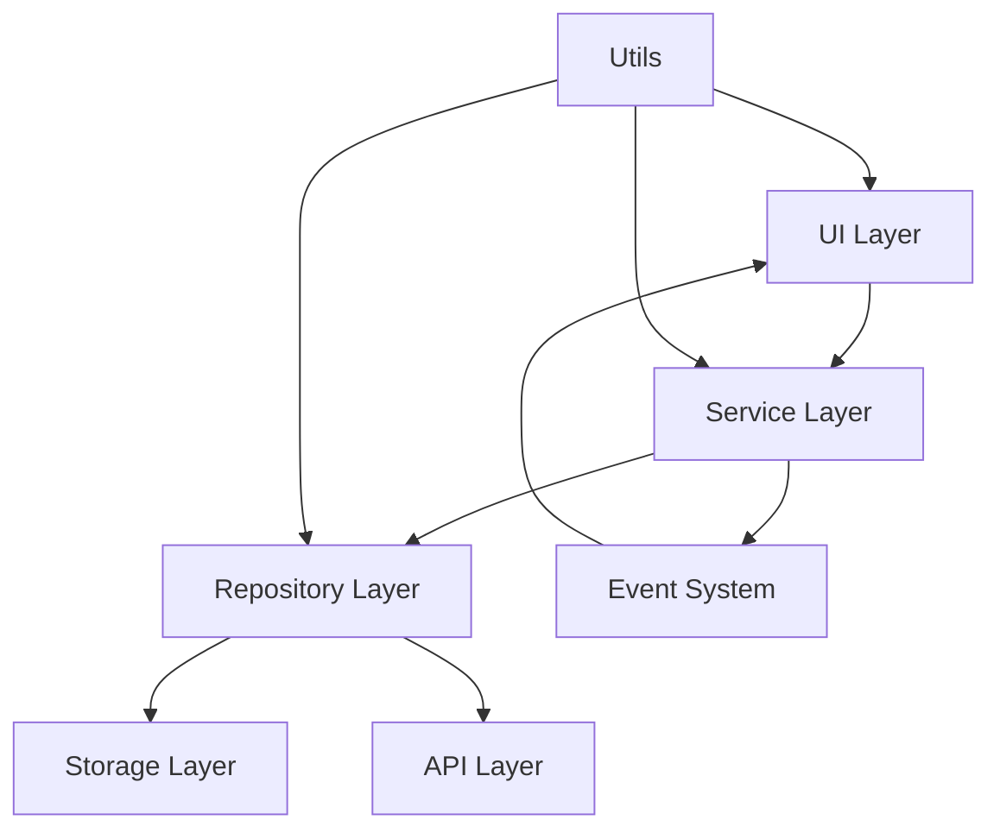

# Arquitectura Propuesta - GestorInventory-Frontend

## 🏗️ Visión General de la Arquitectura

### Principios Arquitectónicos

1. **Separación de Responsabilidades**: Clara división entre capas de presentación, lógica de negocio y acceso a datos
2. **Inversión de Dependencias**: Las capas superiores no dependen de las inferiores directamente
3. **Modularidad**: Componentes independientes y reutilizables
4. **Testabilidad**: Arquitectura que facilita la creación de tests unitarios e integración
5. **Escalabilidad**: Diseño que permite agregar nuevas funcionalidades sin romper el código existente

## 📁 Estructura de Carpetas Propuesta

```
/src
├── /api                    # Capa de acceso a datos externos
│   ├── supabase-client.js  # Cliente configurado para Supabase
│   ├── product-api.js      # Operaciones API para productos
│   ├── inventory-api.js    # Operaciones API para inventario
│   ├── auth-api.js         # Operaciones API para autenticación
│   └── user-api.js         # Operaciones API para usuarios
│
├── /core                   # Núcleo de la aplicación
│   ├── /models             # Modelos de dominio
│   │   ├── product.js      # Modelo de producto
│   │   ├── inventory.js    # Modelo de inventario
│   │   ├── user.js         # Modelo de usuario
│   │   ├── batch.js        # Modelo de lote
│   │   └── location.js     # Modelo de ubicación
│   │
│   ├── /repositories       # Patrón Repository para acceso a datos
│   │   ├── base-repository.js        # Clase base abstracta
│   │   ├── product-repository.js     # Repositorio de productos
│   │   ├── inventory-repository.js   # Repositorio de inventario
│   │   ├── user-repository.js        # Repositorio de usuarios
│   │   └── batch-repository.js       # Repositorio de lotes
│   │
│   ├── /services           # Lógica de negocio
│   │   ├── product-service.js        # Servicios de productos
│   │   ├── inventory-service.js      # Servicios de inventario
│   │   ├── auth-service.js           # Servicios de autenticación
│   │   ├── batch-service.js          # Servicios de lotes
│   │   └── sync-service.js           # Servicios de sincronización
│   │
│   └── /events             # Sistema de eventos
│       ├── event-emitter.js          # Emisor de eventos base
│       ├── product-events.js         # Eventos de productos
│       └── inventory-events.js       # Eventos de inventario
│
├── /ui                     # Capa de presentación
│   ├── /components         # Componentes reutilizables
│   │   ├── scanner.js      # Componente de escaneo
│   │   ├── product-card.js # Tarjeta de producto
│   │   ├── inventory-form.js # Formulario de inventario
│   │   ├── data-table.js   # Tabla de datos genérica
│   │   └── modal.js        # Modal genérico
│   │
│   ├── /pages              # Controladores de página
│   │   ├── product-page.js # Página de productos
│   │   ├── inventory-page.js # Página de inventario
│   │   ├── settings-page.js # Página de configuraciones
│   │   └── reports-page.js # Página de reportes
│   │
│   └── /layouts            # Layouts de aplicación
│       ├── main-layout.js  # Layout principal
│       └── auth-layout.js  # Layout de autenticación
│
├── /utils                  # Utilidades generales
│   ├── logger.js           # Sistema de logging
│   ├── validation.js       # Utilidades de validación
│   ├── date-utils.js       # Utilidades de fecha
│   ├── format-utils.js     # Utilidades de formato
│   └── constants.js        # Constantes de aplicación
│
├── /storage                # Capa de almacenamiento
│   ├── indexed-db.js       # Abstracción de IndexedDB
│   ├── local-storage.js    # Abstracción de localStorage
│   ├── sync-queue.js       # Cola de sincronización
│   └── cache-manager.js    # Gestor de caché
│
├── /config                 # Configuración
│   ├── app-config.js       # Configuración de aplicación
│   ├── database-config.js  # Configuración de base de datos
│   └── api-config.js       # Configuración de API
│
└── /types                  # Definiciones de tipos (para futuro TypeScript)
    ├── product.types.js    # Tipos de producto
    ├── inventory.types.js  # Tipos de inventario
    └── common.types.js     # Tipos comunes
```

## 🔄 Flujo de Datos

### Arquitectura en Capas



### 1. **UI Layer (Presentación)**
- **Responsabilidad**: Manejo de interfaz de usuario, eventos DOM, validación de entrada
- **Componentes**: Pages, Components, Layouts
- **Principios**: No contiene lógica de negocio, solo presenta datos y captura interacciones

### 2. **Service Layer (Lógica de Negocio)**
- **Responsabilidad**: Implementa reglas de negocio, orquesta operaciones, maneja workflows
- **Componentes**: Services
- **Principios**: Stateless, reutilizable, testeable

### 3. **Repository Layer (Acceso a Datos)**
- **Responsabilidad**: Abstrae el acceso a diferentes fuentes de datos
- **Componentes**: Repositories
- **Principios**: Patrón Repository, abstracción de almacenamiento

### 4. **Storage Layer (Persistencia)**
- **Responsabilidad**: Manejo directo de datos (IndexedDB, localStorage, API)
- **Componentes**: Storage abstractions, API clients
- **Principios**: Encapsulación de tecnologías de persistencia

## 🔧 Implementación de Patrones

### 1. Repository Pattern

```javascript
// base-repository.js
export class BaseRepository {
  constructor(storage, apiClient) {
    this.storage = storage;
    this.apiClient = apiClient;
  }

  async findById(id) {
    // Buscar primero en storage local
    let entity = await this.storage.get(id);
    
    if (!entity && navigator.onLine) {
      // Si no existe localmente, buscar en API
      entity = await this.apiClient.findById(id);
      if (entity) {
        await this.storage.set(id, entity);
      }
    }
    
    return entity;
  }

  async save(entity) {
    // Guardar localmente
    await this.storage.set(entity.id, entity);
    
    // Sincronizar con API si hay conexión
    if (navigator.onLine) {
      try {
        await this.apiClient.save(entity);
      } catch (error) {
        // Agregar a cola de sincronización
        await this.addToSyncQueue(entity);
      }
    }
    
    return entity;
  }
}
```

### 2. Service Pattern

```javascript
// product-service.js
export class ProductService {
  constructor(productRepository, validator, eventEmitter) {
    this.repository = productRepository;
    this.validator = validator;
    this.events = eventEmitter;
  }

  async createProduct(productData) {
    // Validar datos
    const validationResult = this.validator.validate(productData);
    if (!validationResult.isValid) {
      throw new ValidationError(validationResult.errors);
    }

    // Crear producto
    const product = new Product(productData);
    
    // Guardar
    const savedProduct = await this.repository.save(product);
    
    // Emitir evento
    this.events.emit('product:created', savedProduct);
    
    return savedProduct;
  }

  async findProductByBarcode(barcode) {
    if (!barcode) {
      throw new ValidationError('Código de barras requerido');
    }

    const product = await this.repository.findByBarcode(barcode);
    
    if (product) {
      this.events.emit('product:found', product);
    } else {
      this.events.emit('product:not-found', { barcode });
    }
    
    return product;
  }
}
```

### 3. Observer Pattern (Sistema de Eventos)

```javascript
// event-emitter.js
export class EventEmitter {
  constructor() {
    this.events = {};
  }

  on(event, listener) {
    if (!this.events[event]) {
      this.events[event] = [];
    }
    this.events[event].push(listener);
  }

  emit(event, data) {
    if (this.events[event]) {
      this.events[event].forEach(listener => {
        try {
          listener(data);
        } catch (error) {
          console.error(`Error in event listener for ${event}:`, error);
        }
      });
    }
  }

  off(event, listener) {
    if (this.events[event]) {
      this.events[event] = this.events[event].filter(l => l !== listener);
    }
  }
}
```

### 4. Factory Pattern

```javascript
// service-factory.js
export class ServiceFactory {
  constructor() {
    this.services = new Map();
    this.repositories = new Map();
  }

  createProductService() {
    if (!this.services.has('product')) {
      const repository = this.createProductRepository();
      const validator = new ProductValidator();
      const eventEmitter = this.createEventEmitter();
      
      this.services.set('product', new ProductService(repository, validator, eventEmitter));
    }
    
    return this.services.get('product');
  }

  createProductRepository() {
    if (!this.repositories.has('product')) {
      const storage = new IndexedDBStorage('products');
      const apiClient = new ProductApiClient();
      
      this.repositories.set('product', new ProductRepository(storage, apiClient));
    }
    
    return this.repositories.get('product');
  }
}
```

## 🧪 Estrategia de Testing

### Estructura de Tests por Capa

```
/tests
├── /unit
│   ├── /core
│   │   ├── /models         # Tests de modelos
│   │   ├── /services       # Tests de servicios
│   │   └── /repositories   # Tests de repositorios
│   ├── /utils              # Tests de utilidades
│   └── /ui
│       └── /components     # Tests de componentes
│
├── /integration
│   ├── /storage           # Tests de integración de storage
│   ├── /api               # Tests de integración de API
│   └── /workflows         # Tests de flujos completos
│
├── /e2e                   # Tests end-to-end
│   ├── product-workflow.test.js
│   ├── inventory-workflow.test.js
│   └── auth-workflow.test.js
│
├── /mocks                 # Mocks y fixtures
│   ├── product-mocks.js
│   ├── inventory-mocks.js
│   └── api-mocks.js
│
└── /fixtures              # Datos de prueba
    ├── products.json
    └── inventory.json
```

## 🚀 Plan de Migración

### Fase 1: Preparación (Semana 1-2)
1. Crear nueva estructura de carpetas
2. Configurar herramientas de desarrollo
3. Establecer convenciones de código
4. Crear tests base

### Fase 2: Migración del Core (Semana 3-4)
1. Migrar modelos de dominio
2. Implementar repositorios base
3. Crear servicios principales
4. Implementar sistema de eventos

### Fase 3: Migración de UI (Semana 5-6)
1. Refactorizar componentes existentes
2. Crear páginas con nueva arquitectura
3. Implementar layouts
4. Migrar formularios y validaciones

### Fase 4: Optimización (Semana 7-8)
1. Optimizar rendimiento
2. Mejorar sistema de caché
3. Implementar lazy loading
4. Optimizar bundle size

### Fase 5: Testing y Documentación (Semana 9-10)
1. Completar cobertura de tests
2. Documentar APIs
3. Crear guías de desarrollo
4. Testing de rendimiento

## 📊 Beneficios Esperados

### Mantenibilidad
- **Separación clara de responsabilidades**: Cada módulo tiene una función específica
- **Bajo acoplamiento**: Los cambios en una capa no afectan otras
- **Alta cohesión**: Elementos relacionados están agrupados

### Testabilidad
- **Inyección de dependencias**: Facilita la creación de mocks
- **Funciones puras**: Servicios sin estado son fáciles de testear
- **Separación de lógica**: UI sin lógica de negocio

### Escalabilidad
- **Modularidad**: Nuevas funcionalidades se añaden sin modificar código existente
- **Reutilización**: Componentes y servicios reutilizables
- **Configurabilidad**: Fácil adaptación a diferentes entornos

### Rendimiento
- **Lazy loading**: Carga bajo demanda de módulos
- **Caché inteligente**: Sistema de caché multicapa
- **Optimización de bundle**: División de código por funcionalidad

## 🔍 Métricas de Calidad

### Métricas de Código
- **Complejidad ciclomática**: < 10 por función
- **Líneas por función**: < 50
- **Líneas por archivo**: < 500
- **Cobertura de tests**: > 80%

### Métricas de Arquitectura
- **Acoplamiento aferente/eferente**: Medición de dependencias
- **Abstracción vs Inestabilidad**: Balance entre flexibilidad y estabilidad
- **Distancia de secuencia principal**: Qué tan cerca está la arquitectura del ideal

### Métricas de Rendimiento
- **Time to Interactive**: < 3 segundos
- **First Contentful Paint**: < 1.5 segundos
- **Bundle size**: < 500KB inicial
- **Memory usage**: < 50MB en uso normal
