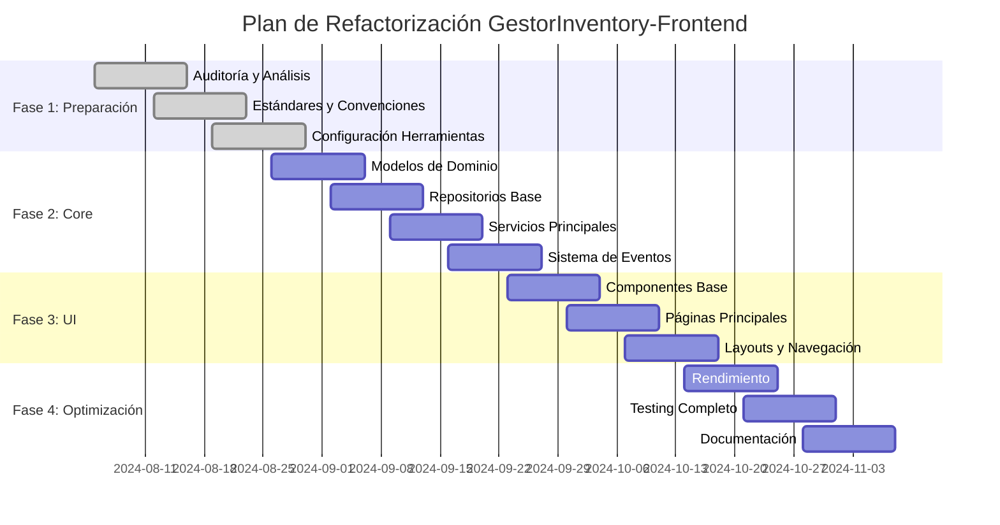

# Plan de Trabajo Detallado - Refactorización GestorInventory-Frontend

## 📋 Resumen Ejecutivo

Este documento presenta el plan detallado para la refactorización completa del frontend de GestorInventory, transformándolo de una aplicación monolítica a una arquitectura modular, mantenible y escalable.

## 🎯 Objetivos

### Objetivos Principales
1. **Mejorar la mantenibilidad** del código mediante separación de responsabilidades
2. **Aumentar la testabilidad** con arquitectura desacoplada
3. **Facilitar el escalamiento** con estructura modular
4. **Optimizar el rendimiento** con lazy loading y optimizaciones
5. **Establecer estándares** de calidad de código

### Objetivos Secundarios
- Documentación completa de la arquitectura
- Configuración de CI/CD
- Implementación de métricas de calidad
- Capacitación del equipo en las nuevas prácticas

## 📅 Cronograma General (10 Semanas)



## 📊 Fase 1: Preparación y Auditoría (Completada)

### ✅ Semana 1-2: Auditoría y Análisis

#### Entregables Completados
- [x] **Analizador de dependencias** (`tools/dependency-analyzer.js`)
- [x] **Reporte de estructura actual** (en `tools/dependency-report.json`)
- [x] **Identificación de problemas** arquitectónicos
- [x] **Mapeo de dependencias** entre módulos

#### Hallazgos Principales
- **Archivos muy grandes**: `db-operations.js` (1300+ líneas)
- **Alta complejidad**: Funciones con complejidad ciclomática > 10
- **Acoplamiento fuerte**: Dependencias circulares detectadas
- **Duplicación de código**: Patrones repetidos en múltiples archivos

### ✅ Semana 2-3: Definición de Estándares

#### Entregables Completados
- [x] **Configuración ESLint** (`.eslintrc.json`)
- [x] **Configuración Prettier** (`.prettierrc`)
- [x] **Convenciones de código** (`docs/CODING_CONVENTIONS.md`)
- [x] **Documento de arquitectura** (`docs/ARCHITECTURE.md`)

#### Estándares Establecidos
- Nomenclatura consistente (camelCase, PascalCase, kebab-case)
- Límites de complejidad (máx. 10 por función)
- Límites de tamaño (máx. 50 líneas por función, 500 por archivo)
- Patrones de imports/exports
- Documentación JSDoc obligatoria

### ✅ Semana 3: Configuración de Herramientas

#### Entregables Completados
- [x] **Configuración Jest** (`jest.config.js`)
- [x] **Setup de testing** (`tests/setup.js`)
- [x] **Package.json** con scripts y dependencias
- [x] **Babel config** (`babel.config.json`)
- [x] **Migration helper** (`tools/migration-helper.js`)

#### Herramientas Configuradas
- **Testing**: Jest con jsdom, coverage reports
- **Linting**: ESLint con reglas personalizadas
- **Formatting**: Prettier con configuración específica
- **Build**: Scripts para desarrollo y producción
- **Analysis**: Herramientas de análisis de código

## 📋 Fase 2: Migración del Core (4 Semanas)

### 🔄 Semana 4: Modelos de Dominio

#### Objetivos
- Crear modelos base para entidades principales
- Establecer validaciones de dominio
- Implementar serialización/deserialización

#### Tareas Detalladas

##### Día 1-2: Modelo Base
```javascript
// src/core/models/base-model.js
- [ ] Implementar clase BaseModel
- [ ] Sistema de validación integrado
- [ ] Manejo de timestamps automático
- [ ] Serialización JSON
- [ ] Generación de IDs únicos
```

##### Día 3: Modelos Principales
```javascript
// src/core/models/product.js
- [ ] Modelo Product extendiendo BaseModel
- [ ] Validaciones específicas de producto
- [ ] Métodos de negocio (calculateTotal, etc.)

// src/core/models/inventory.js
- [ ] Modelo Inventory
- [ ] Validaciones de stock
- [ ] Cálculos de vencimiento
```

##### Día 4-5: Modelos Secundarios
```javascript
// src/core/models/batch.js
- [ ] Modelo para lotes
- [ ] Validaciones de fechas
- [ ] Relaciones con productos

// src/core/models/location.js
- [ ] Modelo de ubicaciones
- [ ] Jerarquía de almacenes
```

#### Tests Asociados
- [ ] Tests unitarios para cada modelo
- [ ] Tests de validación
- [ ] Tests de serialización
- [ ] Tests de relaciones

#### Criterios de Aceptación
- ✅ Todos los modelos tienen validación completa
- ✅ Cobertura de tests > 90%
- ✅ Documentación JSDoc completa
- ✅ Sin dependencias circulares

### 🔄 Semana 5: Repositorios Base

#### Objetivos
- Implementar patrón Repository
- Abstracción de almacenamiento local/remoto
- Sistema de sincronización offline-first

#### Tareas Detalladas

##### Día 1-2: Repository Base
```javascript
// src/core/repositories/base-repository.js
- [ ] Clase BaseRepository abstracta
- [ ] Interface para storage local/remoto
- [ ] Sistema de cache integrado
- [ ] Manejo de conflictos de sincronización
```

##### Día 3: Repositorios Específicos
```javascript
// src/core/repositories/product-repository.js
- [ ] Implementación específica para productos
- [ ] Búsquedas optimizadas por código/nombre
- [ ] Filtros y ordenamiento

// src/core/repositories/inventory-repository.js
- [ ] Gestión de inventario
- [ ] Queries complejas por ubicación/fecha
- [ ] Agregaciones (totales, estadísticas)
```

##### Día 4-5: Integración con Storage
```javascript
// src/storage/indexed-db.js
- [ ] Abstracción completa de IndexedDB
- [ ] Transacciones y rollbacks
- [ ] Migraciones de esquema

// src/storage/sync-queue.js
- [ ] Cola de sincronización robusta
- [ ] Retry logic con backoff
- [ ] Resolución de conflictos
```

#### Tests Asociados
- [ ] Tests unitarios de repositorios
- [ ] Tests de integración con storage
- [ ] Tests de sincronización
- [ ] Tests de performance

### 🔄 Semana 6: Servicios Principales

#### Objetivos
- Implementar lógica de negocio
- Orquestación de operaciones complejas
- Manejo de eventos y notificaciones

#### Tareas Detalladas

##### Día 1-2: Service Base
```javascript
// src/core/services/base-service.js
- [ ] Clase BaseService con funcionalidad común
- [ ] Inyección de dependencias
- [ ] Manejo de errores estándar
- [ ] Logging integrado
```

##### Día 3: Servicios Principales
```javascript
// src/core/services/product-service.js
- [ ] CRUD completo de productos
- [ ] Validaciones de negocio
- [ ] Búsquedas avanzadas
- [ ] Importación/exportación

// src/core/services/inventory-service.js
- [ ] Gestión de stock
- [ ] Movimientos de inventario
- [ ] Alertas de stock bajo
- [ ] Reportes automáticos
```

##### Día 4-5: Servicios Secundarios
```javascript
// src/core/services/auth-service.js
- [ ] Autenticación y autorización
- [ ] Gestión de sesiones
- [ ] Refresh tokens

// src/core/services/sync-service.js
- [ ] Sincronización inteligente
- [ ] Detección de cambios
- [ ] Resolución de conflictos
```

#### Tests Asociados
- [ ] Tests unitarios con mocks
- [ ] Tests de integración entre servicios
- [ ] Tests de workflows completos
- [ ] Tests de manejo de errores

### 🔄 Semana 7: Sistema de Eventos

#### Objetivos
- Comunicación desacoplada entre módulos
- Sistema de notificaciones
- Auditoria de acciones

#### Tareas Detalladas

##### Día 1-2: Event System Core
```javascript
// src/core/events/event-emitter.js
- [ ] EventEmitter robusto
- [ ] Namespacing de eventos
- [ ] Prioridades y filtros
- [ ] Memory leak prevention

// src/core/events/event-bus.js
- [ ] Bus global de eventos
- [ ] Middleware support
- [ ] Event replay para debugging
```

##### Día 3-4: Event Handlers
```javascript
// src/core/events/product-events.js
- [ ] Eventos de producto
- [ ] Handlers de validación
- [ ] Notificaciones automáticas

// src/core/events/inventory-events.js
- [ ] Eventos de inventario
- [ ] Triggers de sincronización
- [ ] Alertas de stock
```

##### Día 5: Integration Testing
- [ ] Tests de flujo completo con eventos
- [ ] Performance testing del event system
- [ ] Memory leak testing

## 📱 Fase 3: Migración de UI (4 Semanas)

### 🔄 Semana 8: Componentes Base

#### Objetivos
- Crear componentes reutilizables
- Separar lógica de presentación
- Implementar design system

#### Tareas Detalladas

##### Día 1-2: Component Framework
```javascript
// src/ui/components/base-component.js
- [ ] Clase base para componentes
- [ ] Lifecycle management
- [ ] Event binding automático
- [ ] State management local

// src/ui/components/form-component.js
- [ ] Componente base para formularios
- [ ] Validación en tiempo real
- [ ] Serialización automática
```

##### Día 3-4: Componentes Específicos
```javascript
// src/ui/components/scanner.js
- [ ] Refactorizar scanner existente
- [ ] Mejor manejo de errores
- [ ] Múltiples formatos de código

// src/ui/components/data-table.js
- [ ] Tabla genérica reutilizable
- [ ] Sorting, filtering, pagination
- [ ] Responsive design

// src/ui/components/modal.js
- [ ] Sistema de modales
- [ ] Stacking y focus management
- [ ] Animaciones suaves
```

##### Día 5: Component Integration
- [ ] Tests de componentes
- [ ] Storybook setup (opcional)
- [ ] Documentación de componentes

### 🔄 Semana 9: Páginas Principales

#### Objetivos
- Migrar páginas existentes
- Implementar routing moderno
- Optimizar carga de datos

#### Tareas Detalladas

##### Día 1-2: Page Framework
```javascript
// src/ui/pages/base-page.js
- [ ] Clase base para páginas
- [ ] Lazy loading automático
- [ ] SEO metadata
- [ ] Loading states

// src/ui/router/router.js
- [ ] Sistema de routing SPA
- [ ] History API integration
- [ ] Route guards
```

##### Día 3-4: Páginas Específicas
```javascript
// src/ui/pages/product-page.js
- [ ] Migrar desde plantillas/agregar.html
- [ ] Integrar con nuevos servicios
- [ ] Optimizar UX

// src/ui/pages/inventory-page.js
- [ ] Migrar desde plantillas/inventario.html
- [ ] Real-time updates
- [ ] Bulk operations

// src/ui/pages/reports-page.js
- [ ] Migrar desde plantillas/report.html
- [ ] Charts y visualizaciones
- [ ] Export functionality
```

### 🔄 Semana 10: Layouts y Navegación

#### Objetivos
- Sistema de layouts consistente
- Navegación intuitiva
- Responsive design

#### Tareas Detalladas

##### Día 1-2: Layout System
```javascript
// src/ui/layouts/main-layout.js
- [ ] Layout principal de la app
- [ ] Sidebar navigation
- [ ] Header con acciones globales
- [ ] Footer con información

// src/ui/layouts/auth-layout.js
- [ ] Layout para autenticación
- [ ] Formularios centrados
- [ ] Branding consistente
```

##### Día 3-4: Navigation
```javascript
// src/ui/components/navigation.js
- [ ] Menú principal responsive
- [ ] Breadcrumbs automáticos
- [ ] Search global
- [ ] User menu

// src/ui/components/sidebar.js
- [ ] Sidebar colapsible
- [ ] Menú contextual
- [ ] Quick actions
```

##### Día 5: Mobile Optimization
- [ ] Touch-friendly interfaces
- [ ] Swipe gestures
- [ ] Mobile-specific optimizations

## 🚀 Fase 4: Optimización y Testing (2 Semanas)

### 🔄 Semana 11: Optimización de Rendimiento

#### Objetivos
- Lazy loading de módulos
- Optimización de bundle
- Caching inteligente

#### Tareas Detalladas

##### Día 1-2: Bundle Optimization
- [ ] Code splitting por rutas
- [ ] Tree shaking configuration
- [ ] Dynamic imports
- [ ] Asset optimization

##### Día 3-4: Caching Strategy
- [ ] Service Worker implementation
- [ ] Cache-first strategy
- [ ] Background sync
- [ ] Offline functionality

##### Día 5: Performance Testing
- [ ] Lighthouse audits
- [ ] Bundle size analysis
- [ ] Runtime performance testing
- [ ] Memory leak detection

### 🔄 Semana 12: Testing Completo y Documentación

#### Objetivos
- Cobertura completa de tests
- Documentación técnica
- Deployment preparation

#### Tareas Detalladas

##### Día 1-2: Test Coverage
- [ ] Completar tests unitarios (>90% coverage)
- [ ] Tests de integración completos
- [ ] E2E tests críticos
- [ ] Performance regression tests

##### Día 3-4: Documentation
- [ ] API documentation
- [ ] Architecture diagrams
- [ ] Deployment guide
- [ ] Migration guide

##### Día 5: Final Integration
- [ ] Production build optimization
- [ ] CI/CD pipeline setup
- [ ] Monitoring and analytics
- [ ] Go-live preparation

## 📊 Métricas de Éxito

### Métricas Técnicas
- **Cobertura de tests**: >90%
- **Complejidad ciclomática**: <10 promedio
- **Bundle size**: <500KB inicial
- **Time to Interactive**: <3 segundos
- **Lighthouse score**: >90

### Métricas de Calidad
- **Code duplication**: <5%
- **Technical debt ratio**: <10%
- **Maintainability index**: >70
- **Dependency vulnerabilities**: 0 high/critical

### Métricas de Productividad
- **Tiempo de build**: <30 segundos
- **Tiempo de tests**: <2 minutos
- **Hot reload**: <1 segundo
- **Deployment time**: <5 minutos

## 🎯 Entregables Finales

### Código
- [ ] Aplicación completamente refactorizada
- [ ] Tests completos con alta cobertura
- [ ] Documentación técnica completa
- [ ] Scripts de migración y deployment

### Documentación
- [ ] Guía de arquitectura
- [ ] Manual de desarrollo
- [ ] Guía de contribución
- [ ] Troubleshooting guide

### Herramientas
- [ ] Pipeline CI/CD completo
- [ ] Monitoring y alertas
- [ ] Performance dashboard
- [ ] Development tools

## ⚠️ Riesgos y Mitigaciones

### Riesgos Técnicos
| Riesgo | Probabilidad | Impacto | Mitigación |
|--------|--------------|---------|------------|
| Breaking changes en dependencies | Media | Alto | Version pinning, tests exhaustivos |
| Performance degradation | Media | Alto | Continuous monitoring, benchmarks |
| Data migration issues | Baja | Alto | Comprehensive backup strategy |

### Riesgos de Proyecto
| Riesgo | Probabilidad | Impacto | Mitigación |
|--------|--------------|---------|------------|
| Scope creep | Alta | Medio | Strict change control |
| Resource availability | Media | Alto | Cross-training, documentation |
| Timeline slippage | Media | Medio | Regular reviews, buffer time |

## 📈 Plan de Rollback

En caso de problemas críticos:

1. **Immediate rollback**: Revertir a versión anterior (< 5 minutos)
2. **Data integrity check**: Verificar integridad de datos
3. **Issue analysis**: Identificar causa raíz
4. **Hotfix deployment**: Aplicar corrección específica
5. **Progressive rollout**: Reintroducir cambios gradualmente

## 🎓 Plan de Capacitación

### Para Desarrolladores
- [ ] Workshop de nueva arquitectura (4 horas)
- [ ] Sesión de coding standards (2 horas)
- [ ] Training en herramientas de testing (2 horas)
- [ ] Code review process (1 hora)

### Para QA
- [ ] Nuevos flujos de testing (2 horas)
- [ ] Automation tools training (3 horas)
- [ ] Performance testing (2 horas)

### Para DevOps
- [ ] Deployment pipeline (2 horas)
- [ ] Monitoring setup (2 horas)
- [ ] Troubleshooting guide (1 hora)

---

**Estado del Plan**: ✅ Fase 1 Completada - En progreso hacia Fase 2
**Próximo Milestone**: Semana 4 - Modelos de Dominio
**Revisión**: Semanal todos los viernes
**Contacto**: Angel Aramiz - Project Lead
